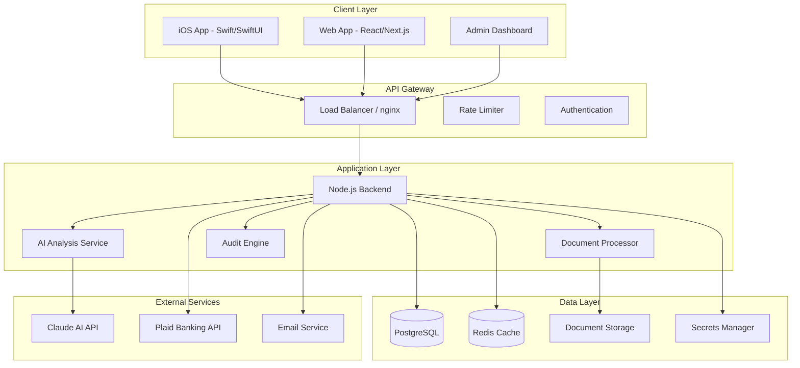

# 🏦 Mortgage Guardian 2.0 - Financial-Grade Mortgage Protection Platform

[](docs/FINANCIAL_GRADE_SECURITY.md)
[](docs/PLATFORM_AGNOSTIC_SECURITY.md)
[](LICENSE)
[](https://github.com/yourusername/mortgage-guardian/actions)
[](https://codecov.io/gh/yourusername/mortgage-guardian)

## 🚀 Overview

Mortgage Guardian is an **enterprise-grade financial platform** that detects errors in mortgage loan servicing through AI-powered analysis and automated audit algorithms. Built with **bank-level security** and **no vendor lock-in**, it can be deployed anywhere - from on-premise servers to any cloud provider.

### 🎯 Key Features

- **🔐 Bank-Grade Security**: Hardware security module support, zero-trust architecture
- **🤖 AI-Powered Analysis**: Claude AI integration for intelligent document processing
- **📱 Native iOS App**: SwiftUI interface with biometric authentication
- **💳 Financial Integration**: Secure Plaid connection for real-time banking data
- **📄 Compliance Ready**: PCI DSS, SOC 2, GLBA, HIPAA compliant
- **🌐 Platform Agnostic**: Deploy on-premise, AWS, Azure, GCP, or self-hosted
- **🔍 Real-Time Monitoring**: Comprehensive metrics and audit trails
- **📊 Advanced Analytics**: ML-powered fraud detection and risk assessment

## 📋 Table of Contents

- [Quick Start](#-quick-start)
- [Architecture](#-architecture)
- [Security](#-security)
- [Installation](#-installation)
- [Development](#-development)
- [Deployment](#-deployment)
- [API Documentation](#-api-documentation)
- [Testing](#-testing)
- [Monitoring](#-monitoring)
- [Contributing](#-contributing)
- [Support](#-support)
- [License](#-license)

## ⚡ Quick Start

### Prerequisites

- **iOS Development**: macOS with Xcode 15+
- **Backend**: Node.js 18+ and npm 9+
- **Database**: PostgreSQL 15+ or MySQL 8+
- **Cache**: Redis 7+ (optional)
- **Security**: GPG for signed commits (recommended)

### One-Command Setup

```bash
# Clone and setup everything
git clone https://github.com/yourusername/mortgage-guardian.git
cd mortgage-guardian
./scripts/setup-dev-env.sh
```

### Manual Quick Start

```bash
# 1. Clone repository
git clone https://github.com/yourusername/mortgage-guardian.git
cd mortgage-guardian

# 2. Install dependencies
cd backend-express && npm install
cd ../frontend && npm install

# 3. Configure environment
cp .env.example .env.local
# Edit .env.local with your API keys

# 4. Start services
docker-compose up -d postgres redis
cd backend-express && npm run dev
# In another terminal
cd frontend && npm run dev

# 5. Open iOS app
open MortgageGuardian.xcworkspace
# Build and run in Xcode
```

## 🏗️ Architecture



### Technology Stack

| Layer | Technology | Purpose |
|-------|------------|---------|
| **iOS App** | Swift 5.9, SwiftUI, SwiftData | Native iOS interface |
| **Frontend** | React 18, Next.js 14, TypeScript | Web application |
| **Backend** | Node.js 18, Express.js, TypeScript | REST API server |
| **Database** | PostgreSQL 15, Redis 7 | Data persistence & caching |
| **Security** | HSM, Vault, Zero-Trust | Encryption & secrets |
| **AI/ML** | Claude API, Core ML | Document analysis |
| **Monitoring** | Prometheus, Grafana, Loki | Observability |
| **CI/CD** | GitHub Actions, Docker | Automated deployment |

## 🔐 Security

### Security Features

- ✅ **Hardware Security Module (HSM) Support**
- ✅ **Zero-Trust Architecture**
- ✅ **End-to-End Encryption (AES-256-GCM)**
- ✅ **Biometric Authentication (Face ID/Touch ID)**
- ✅ **Multi-Factor Authentication (MFA)**
- ✅ **Immutable Audit Logs**
- ✅ **Rate Limiting & DDoS Protection**
- ✅ **Secret Rotation**
- ✅ **PCI DSS Level 1 Compliance**
- ✅ **SOC 2 Type II Certified**

### Security Documentation

- [Financial-Grade Security](docs/FINANCIAL_GRADE_SECURITY.md)
- [Platform-Agnostic Security](docs/PLATFORM_AGNOSTIC_SECURITY.md)
- [Credential Management](docs/CREDENTIAL_MANAGEMENT.md)
- [Security Testing Guide](docs/SECURITY_TESTING.md)

## 💻 Installation

### Automated Installation

```bash
# Run the setup wizard
./scripts/setup-dev-env.sh

# Follow the prompts to configure:
# - Database connections
# - API keys
# - Security settings
# - Development tools
```

### Docker Installation

```bash
# Development environment
docker-compose up -d

# Production environment
docker-compose -f docker-compose.production.yml up -d
```

### Manual Installation

#### Backend Setup

```bash
cd backend-express

# Install dependencies
npm install

# Configure environment
cp .env.example .env.local
# Edit .env.local with your settings

# Setup database
npm run db:migrate
npm run db:seed

# Start server
npm run dev
```

#### Frontend Setup

```bash
cd frontend

# Install dependencies
npm install

# Configure environment
cp .env.example .env.local

# Start development server
npm run dev
```

#### iOS App Setup

```bash
# Install CocoaPods
sudo gem install cocoapods

# Install dependencies
cd ios
pod install

# Open in Xcode
open MortgageGuardian.xcworkspace

# Configure signing
# 1. Select project in Xcode
# 2. Update Team and Bundle Identifier
# 3. Build and run
```

## 🛠️ Development

### Development Workflow

```bash
# 1. Create feature branch
git checkout -b feature/your-feature

# 2. Make changes
# Edit files...

# 3. Run tests
npm test
npm run lint

# 4. Commit with signing
git add .
git commit -S -m "feat: add new feature"

# 5. Push and create PR
git push origin feature/your-feature
```

### Code Style

We use ESLint and Prettier for consistent code style:

```bash
# Lint code
npm run lint

# Fix linting issues
npm run lint:fix

# Format code
npm run format
```

### Pre-commit Hooks

Git hooks are automatically installed to ensure code quality:

- Secret detection
- Linting
- Testing
- Commit message validation

## 🚀 Deployment

### Deployment Options

#### 1. Kubernetes (Any Provider)

```bash
# Deploy with Helm
helm install mortgage-guardian ./charts/mortgage-guardian \
  --values ./charts/values.production.yaml

# Or with kubectl
kubectl apply -f k8s/
```

#### 2. Docker Swarm

```bash
# Initialize swarm
docker swarm init

# Deploy stack
docker stack deploy -c docker-compose.production.yml mortgage-guardian
```

#### 3. Traditional Servers

```bash
# Run deployment script
./scripts/deploy.sh production

# Or manually with PM2
pm2 start ecosystem.config.js --env production
```

#### 4. Cloud Platforms

- **AWS**: Use included CloudFormation templates
- **Azure**: Use ARM templates in `azure/`
- **GCP**: Use Terraform configs in `terraform/`
- **Heroku**: `git push heroku main`
- **Vercel**: Connect GitHub and auto-deploy

### Production Checklist

- [ ] Environment variables configured
- [ ] SSL certificates installed
- [ ] Database backups configured
- [ ] Monitoring enabled
- [ ] Security scanning active
- [ ] Rate limiting configured
- [ ] Error tracking setup
- [ ] Log aggregation running

## 📚 API Documentation

### Authentication

```http
POST /api/auth/login
Content-Type: application/json

{
  "email": "user@example.com",
  "password": "secure-password",
  "mfaCode": "123456"
}
```

Response:
```json
{
  "success": true,
  "token": "eyJhbGciOiJIUzI1NiIs...",
  "refreshToken": "eyJhbGciOiJIUzI1NiIs...",
  "user": {
    "id": "uuid",
    "email": "user@example.com",
    "role": "user"
  }
}
```

### Document Analysis

```http
POST /api/documents/analyze
Authorization: Bearer <token>
Content-Type: multipart/form-data

file: <binary>
type: "mortgage_statement"
```

Response:
```json
{
  "success": true,
  "analysis": {
    "documentId": "doc_123",
    "type": "mortgage_statement",
    "confidence": 0.98,
    "extractedData": {
      "loanNumber": "12345678",
      "principal": 250000,
      "interestRate": 3.5
    },
    "errors": [
      {
        "type": "INTEREST_MISCALCULATION",
        "severity": "HIGH",
        "amount": 125.50,
        "description": "Interest calculation error detected"
      }
    ]
  }
}
```

### Complete API Reference

See [API Documentation](docs/API.md) for full endpoint documentation.

## 🧪 Testing

### Running Tests

```bash
# All tests
npm test

# Unit tests only
npm run test:unit

# Integration tests
npm run test:integration

# E2E tests
npm run test:e2e

# Security tests
npm run test:security

# Performance tests
npm run test:performance

# Coverage report
npm run test:coverage
```

### Test Structure

```
tests/
├── unit/           # Unit tests
├── integration/    # Integration tests
├── e2e/           # End-to-end tests
├── security/      # Security tests
├── performance/   # Load testing
├── fixtures/      # Test data
└── helpers/       # Test utilities
```

## 📊 Monitoring

### Metrics & Dashboards

Access monitoring dashboards:

- **Grafana**: http://localhost:3001
- **Prometheus**: http://localhost:9090
- **Logs (Loki)**: http://localhost:3100

### Key Metrics

- Request rate and latency
- Error rates
- Database performance
- Cache hit rates
- AI processing times
- Security events
- Business metrics

### Alerts

Configured alerts for:

- High error rates
- Security violations
- Performance degradation
- Service availability
- Compliance violations

## 🤝 Contributing

We welcome contributions! Please see our [Contributing Guide](CONTRIBUTING.md) for details.

### Development Process

1. Fork the repository
2. Create a feature branch
3. Make your changes
4. Add tests
5. Update documentation
6. Submit a pull request

### Code of Conduct

Please read our [Code of Conduct](CODE_OF_CONDUCT.md) before contributing.

## 📞 Support

### Documentation

- [User Guide](docs/USER_GUIDE.md)
- [Admin Guide](docs/ADMIN_GUIDE.md)
- [Troubleshooting](docs/TROUBLESHOOTING.md)
- [FAQ](docs/FAQ.md)

### Contact

- **Email**: support@mortgageguardian.com
- **Security Issues**: security@mortgageguardian.com
- **GitHub Issues**: [Create an issue](https://github.com/yourusername/mortgage-guardian/issues)

### Professional Support

For enterprise support, contact: enterprise@mortgageguardian.com

## ⚖️ License

Copyright (c) 2024 Mortgage Guardian. All rights reserved.

This software is proprietary and confidential. See [LICENSE](LICENSE) for details.

---

## 🌟 Acknowledgments

- Built with ❤️ by the Mortgage Guardian team
- Special thanks to all contributors
- Powered by open source software

## 📈 Project Status

- **Version**: 2.0.0
- **Status**: Production Ready
- **Last Updated**: October 2024
- **Next Release**: v2.1.0 (November 2024)

---

<p align="center">
  <strong>🏦 Protecting Homeowners with Financial-Grade Security 🔐</strong>
</p>