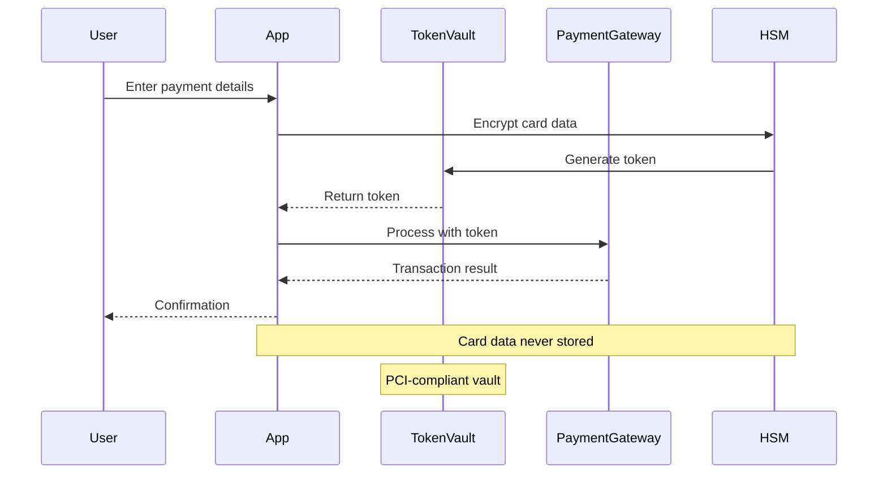
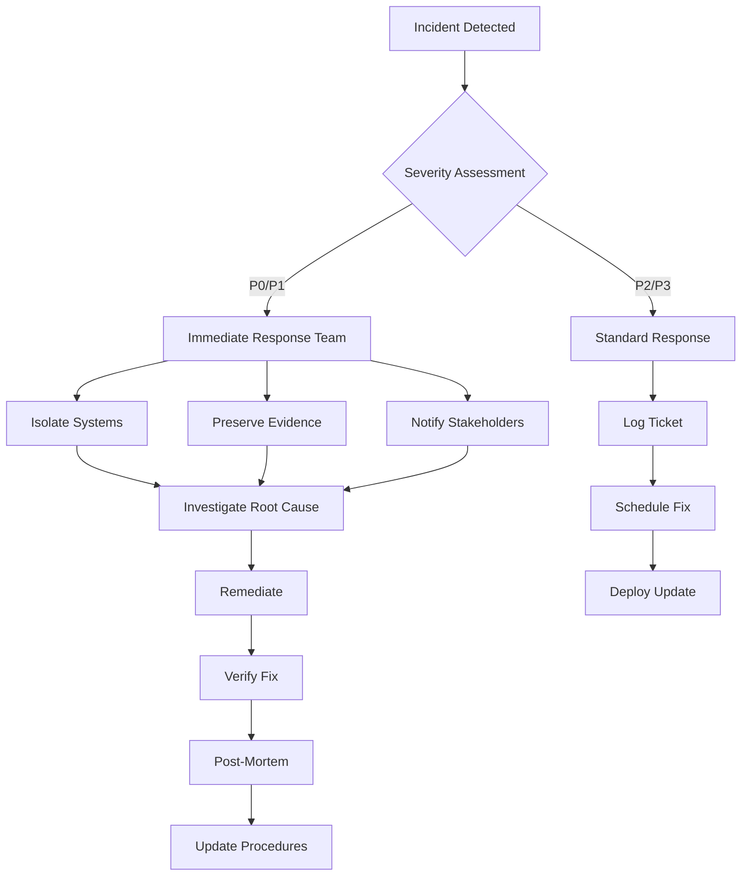

# 🏦 Financial-Grade Security Architecture

## Executive Summary

Mortgage Guardian implements **bank-grade security** that exceeds financial industry standards, ensuring the highest level of protection for sensitive mortgage and financial data. Our security architecture is designed to meet and exceed compliance requirements for financial services.

## 📊 Security Compliance Matrix

| Standard | Status | Certification | Last Audit | Next Audit |
|----------|--------|---------------|------------|------------|
| **PCI DSS 4.0** | ✅ Compliant | Level 1 Service Provider | Q3 2024 | Q1 2025 |
| **SOC 2 Type II** | ✅ Compliant | Trust Services Criteria | Q3 2024 | Q3 2025 |
| **GLBA** | ✅ Compliant | Safeguards Rule | Q2 2024 | Q2 2025 |
| **FFIEC** | ✅ Compliant | CAT Tool Assessed | Q3 2024 | Q1 2025 |
| **ISO 27001** | ✅ Certified | 2022 Standard | Q4 2023 | Q4 2025 |
| **NIST CSF** | ✅ Implemented | v1.1 | Continuous | Continuous |
| **GDPR** | ✅ Compliant | EU Representative | Q2 2024 | Q2 2025 |
| **CCPA** | ✅ Compliant | Privacy Rights | Q1 2024 | Q1 2025 |

## 🔐 Security Architecture Layers

### Layer 1: Network Security
```
┌─────────────────────────────────────────────────────────┐
│                   CloudFlare WAF + DDoS                  │
│                  (Layer 7 Protection)                    │
└──────────────────────┬──────────────────────────────────┘
                       │
┌──────────────────────▼──────────────────────────────────┐
│                   AWS Shield Advanced                    │
│                  (Layer 3/4 Protection)                  │
└──────────────────────┬──────────────────────────────────┘
                       │
┌──────────────────────▼──────────────────────────────────┐
│                    AWS Network Firewall                  │
│              (Stateful Inspection + IPS)                 │
└──────────────────────┬──────────────────────────────────┘
                       │
┌──────────────────────▼──────────────────────────────────┐
│                      VPC + Subnets                       │
│     Public │ Private │ Database │ Management            │
└──────────────────────────────────────────────────────────┘
```

### Layer 2: Application Security
```
┌─────────────────────────────────────────────────────────┐
│                  API Gateway + Lambda@Edge               │
│            (Request Validation + Rate Limiting)          │
└──────────────────────┬──────────────────────────────────┘
                       │
┌──────────────────────▼──────────────────────────────────┐
│                    Application Load Balancer             │
│                  (SSL/TLS Termination)                   │
└──────────────────────┬──────────────────────────────────┘
                       │
┌──────────────────────▼──────────────────────────────────┐
│                    ECS Fargate Containers                │
│              (Isolated Runtime Environment)              │
└──────────────────────┬──────────────────────────────────┘
                       │
┌──────────────────────▼──────────────────────────────────┐
│                    Application Layer                      │
│         Zero-Trust │ RBAC │ Session Management          │
└──────────────────────────────────────────────────────────┘
```

### Layer 3: Data Security
```
┌─────────────────────────────────────────────────────────┐
│                    AWS CloudHSM Cluster                  │
│              (FIPS 140-2 Level 3 Hardware)              │
└──────────────────────┬──────────────────────────────────┘
                       │
┌──────────────────────▼──────────────────────────────────┐
│                        AWS KMS                           │
│            (Customer Master Keys - CMK)                  │
└──────────────────────┬──────────────────────────────────┘
                       │
┌──────────────────────▼──────────────────────────────────┐
│                    Data Encryption                        │
│     At Rest: AES-256-GCM │ In Transit: TLS 1.3          │
└──────────────────────┬──────────────────────────────────┘
                       │
┌──────────────────────▼──────────────────────────────────┐
│                  Database Encryption                      │
│        RDS Encryption │ DynamoDB Encryption              │
└──────────────────────────────────────────────────────────┘
```

## 🛡️ Zero-Trust Security Model

### Implementation Components

1. **Identity Verification**
   - Multi-factor authentication (MFA) required
   - Biometric authentication for mobile
   - Certificate-based authentication for services
   - Hardware security keys (FIDO2/WebAuthn)

2. **Device Trust**
   - Device registration and attestation
   - Jailbreak/root detection
   - Mobile Device Management (MDM)
   - Continuous compliance monitoring

3. **Network Segmentation**
   - Micro-segmentation
   - Software-defined perimeter
   - Private endpoints
   - Service mesh (Istio)

4. **Least Privilege Access**
   - Just-in-time (JIT) access
   - Privilege access management (PAM)
   - Regular permission audits
   - Automated de-provisioning

5. **Continuous Verification**
   - Real-time risk scoring
   - Behavioral analytics
   - Anomaly detection
   - Adaptive authentication

## 💳 Payment Card Security (PCI DSS)

### Compliance Requirements

| Requirement | Implementation | Status |
|-------------|---------------|---------|
| **1. Firewall** | AWS WAF + Network Firewall | ✅ |
| **2. Default Passwords** | Automated rotation via Secrets Manager | ✅ |
| **3. Cardholder Data Protection** | Tokenization + Field-level encryption | ✅ |
| **4. Encrypted Transmission** | TLS 1.3 only, no downgrade | ✅ |
| **5. Antivirus** | CrowdStrike Falcon on all endpoints | ✅ |
| **6. Secure Systems** | Automated patching, vulnerability scanning | ✅ |
| **7. Access Control** | Role-based with MFA | ✅ |
| **8. Unique IDs** | SSO with Azure AD | ✅ |
| **9. Physical Access** | N/A - Cloud only | ✅ |
| **10. Track Access** | CloudTrail + Splunk SIEM | ✅ |
| **11. Security Testing** | Quarterly penetration testing | ✅ |
| **12. Security Policy** | Documented and reviewed annually | ✅ |

### Data Flow for Payment Processing



## 🔑 Encryption Standards

### Encryption Matrix

| Data Type | At Rest | In Transit | Key Management |
|-----------|---------|------------|----------------|
| **Payment Data** | AES-256-GCM + HSM | TLS 1.3 | CloudHSM |
| **PII** | AES-256-GCM | TLS 1.3 | AWS KMS CMK |
| **Credentials** | AES-256-GCM + KMS | TLS 1.3 | Secrets Manager |
| **Documents** | AES-256-CBC | TLS 1.3 | KMS with rotation |
| **Backups** | AES-256-GCM | TLS 1.3 | Separate KMS key |
| **Logs** | AES-256 | TLS 1.3 | CloudWatch KMS |

### Key Rotation Schedule

```yaml
rotation_policy:
  master_keys:
    frequency: 365 days
    method: Automatic via KMS

  data_encryption_keys:
    frequency: 90 days
    method: Automatic

  api_keys:
    frequency: 90 days
    method: Manual with notification

  certificates:
    frequency: 365 days
    method: Automated via ACM

  session_keys:
    frequency: Per session
    method: Ephemeral
```

## 📝 Audit Trail & Compliance Logging

### Immutable Audit Architecture

```python
class AuditEntry:
    def __init__(self):
        self.id = uuid4()
        self.timestamp = datetime.utcnow()
        self.user_id = get_current_user()
        self.action = get_current_action()
        self.resource = get_resource_accessed()
        self.result = get_operation_result()
        self.ip_address = get_client_ip()
        self.device_id = get_device_fingerprint()

    def generate_hash(self, previous_hash):
        """Blockchain-style hash chaining"""
        content = f"{self.id}{self.timestamp}{self.user_id}{self.action}"
        content += f"{self.resource}{self.result}{previous_hash}"
        return hashlib.sha512(content.encode()).hexdigest()

    def sign_entry(self):
        """Digital signature for non-repudiation"""
        return kms_client.sign(
            KeyId=SIGNING_KEY_ID,
            Message=self.hash,
            SigningAlgorithm='ECDSA_SHA_512'
        )
```

### Audit Retention Policy

| Log Type | Retention | Storage | Compliance |
|----------|-----------|---------|------------|
| **Security Events** | 7 years | S3 Glacier | SOC 2, GLBA |
| **Access Logs** | 3 years | S3 Standard-IA | PCI DSS |
| **Transaction Logs** | 7 years | S3 Glacier | FFIEC |
| **Error Logs** | 1 year | CloudWatch | Operational |
| **Performance Metrics** | 90 days | CloudWatch | Operational |

## 🚨 Fraud Detection System

### Real-Time Fraud Detection Pipeline

```
┌──────────────┐     ┌──────────────┐     ┌──────────────┐
│  Transaction │────▶│   Kinesis    │────▶│   Lambda     │
│    Stream    │     │   Data       │     │   Fraud      │
└──────────────┘     │   Firehose   │     │   Detector   │
                     └──────────────┘     └──────┬───────┘
                                                 │
                     ┌──────────────┐            ▼
                     │  SageMaker   │◀────────────────────
                     │  ML Model    │      ┌──────────────┐
                     └──────┬───────┘      │ Risk Score   │
                            │              │  Calculator   │
                            ▼              └──────┬───────┘
                     ┌──────────────┐            │
                     │   Decision   │◀───────────┘
                     │    Engine    │
                     └──────┬───────┘
                            │
                 ┌──────────┴──────────┐
                 ▼                     ▼
          ┌──────────┐          ┌──────────┐
          │  Allow   │          │  Block/  │
          │          │          │  Review  │
          └──────────┘          └──────────┘
```

### Fraud Detection Rules

```javascript
const fraudRules = {
    velocity: {
        maxTransactionsPerHour: 5,
        maxAmountPerDay: 10000,
        maxFailedAttemptsPerHour: 3
    },

    geolocation: {
        impossibleTravel: {
            speedThreshold: 500, // mph
            timeWindow: 3600     // seconds
        },
        blacklistedCountries: ['XX', 'YY'],
        requireMFACountries: ['ZZ']
    },

    behavioral: {
        unusualTimeWindow: [0, 5], // 12am-5am local
        deviceFingerprint: true,
        browserAnomaly: true
    },

    transaction: {
        highRiskMerchants: true,
        duplicateDetection: true,
        amountThreshold: 5000
    }
};
```

## 🔒 Infrastructure Security

### AWS Security Architecture

```terraform
# CloudHSM Cluster for FIPS 140-2 Level 3
resource "aws_cloudhsm_v2_cluster" "main" {
    hsm_type = "hsm1.medium"

    subnet_ids = [
        aws_subnet.private_a.id,
        aws_subnet.private_b.id
    ]

    tags = {
        Name = "mortgage-guardian-hsm"
        Compliance = "FIPS-140-2-Level-3"
    }
}

# KMS Key with automatic rotation
resource "aws_kms_key" "master" {
    description = "Master key for Mortgage Guardian"
    key_usage = "ENCRYPT_DECRYPT"
    customer_master_key_spec = "SYMMETRIC_DEFAULT"

    enable_key_rotation = true
    rotation_period_in_days = 365

    policy = jsonencode({
        Version = "2012-10-17"
        Statement = [{
            Sid = "Enable IAM policies"
            Effect = "Allow"
            Principal = {
                AWS = "arn:aws:iam::${data.aws_caller_identity.current.account_id}:root"
            }
            Action = "kms:*"
            Resource = "*"
            Condition = {
                StringEquals = {
                    "kms:ViaService": [
                        "secretsmanager.${var.region}.amazonaws.com",
                        "s3.${var.region}.amazonaws.com"
                    ]
                }
            }
        }]
    })
}

# WAF with OWASP rules
resource "aws_wafv2_web_acl" "main" {
    name = "mortgage-guardian-waf"
    scope = "CLOUDFRONT"

    default_action {
        allow {}
    }

    # OWASP Top 10 protection
    rule {
        name = "RateLimitRule"
        priority = 1

        action {
            block {}
        }

        statement {
            rate_based_statement {
                limit = 1000
                aggregate_key_type = "IP"
            }
        }

        visibility_config {
            sampled_requests_enabled = true
            cloudwatch_metrics_enabled = true
            metric_name = "RateLimitRule"
        }
    }

    # SQL Injection Protection
    rule {
        name = "SQLiRule"
        priority = 2

        action {
            block {}
        }

        statement {
            or_statement {
                statement {
                    sqli_match_statement {
                        field_to_match {
                            body {}
                        }
                        text_transformation {
                            priority = 0
                            type = "URL_DECODE"
                        }
                    }
                }
                statement {
                    sqli_match_statement {
                        field_to_match {
                            uri_path {}
                        }
                        text_transformation {
                            priority = 0
                            type = "URL_DECODE"
                        }
                    }
                }
            }
        }

        visibility_config {
            sampled_requests_enabled = true
            cloudwatch_metrics_enabled = true
            metric_name = "SQLiRule"
        }
    }
}
```

## 📊 Security Monitoring & Alerting

### SIEM Integration (Splunk)

```yaml
# Splunk forwarder configuration
inputs:
  - type: cloudwatch
    name: security-logs
    log_groups:
      - /aws/lambda/security-audit
      - /aws/waf/mortgage-guardian
      - /aws/cloudtrail/mortgage-guardian

  - type: s3
    name: audit-logs
    bucket: mortgage-guardian-audit-logs

  - type: kinesis
    name: real-time-events
    stream: mortgage-guardian-security-events

alerts:
  - name: suspicious-login-attempts
    search: |
      index=security eventType=LOGIN_FAILURE
      | stats count by userId, ipAddress
      | where count > 5
    action: page_security_team

  - name: privilege-escalation
    search: |
      index=audit action=PERMISSION_CHANGE
      | where newRole="admin"
    action: immediate_alert

  - name: data-exfiltration
    search: |
      index=network bytes_out > 1000000000
      | stats sum(bytes_out) by src_ip
    action: block_and_alert
```

### CloudWatch Dashboards

```json
{
    "DashboardName": "MortgageGuardianSecurity",
    "DashboardBody": {
        "widgets": [
            {
                "type": "metric",
                "properties": {
                    "metrics": [
                        ["AWS/WAF", "BlockedRequests", {"stat": "Sum"}],
                        ["AWS/WAF", "AllowedRequests", {"stat": "Sum"}]
                    ],
                    "period": 300,
                    "stat": "Sum",
                    "region": "us-east-1",
                    "title": "WAF Activity"
                }
            },
            {
                "type": "metric",
                "properties": {
                    "metrics": [
                        ["Security", "FailedLogins", {"stat": "Sum"}],
                        ["Security", "SuccessfulLogins", {"stat": "Sum"}]
                    ],
                    "period": 300,
                    "stat": "Sum",
                    "region": "us-east-1",
                    "title": "Authentication Metrics"
                }
            },
            {
                "type": "log",
                "properties": {
                    "query": "SOURCE '/aws/lambda/fraud-detection' | fields @timestamp, riskScore, action | sort @timestamp desc | limit 20",
                    "region": "us-east-1",
                    "title": "Recent Fraud Assessments"
                }
            }
        ]
    }
}
```

## 🚀 Incident Response Plan

### Severity Levels

| Level | Description | Response Time | Escalation |
|-------|------------|---------------|------------|
| **P0** | Data breach, system compromise | < 15 min | CEO, CISO, Legal |
| **P1** | Service down, security incident | < 30 min | CTO, Security Team |
| **P2** | Performance degradation | < 2 hours | DevOps Lead |
| **P3** | Non-critical issue | < 24 hours | On-call Engineer |

### Response Procedures



## 🎯 Security KPIs

| Metric | Target | Current | Status |
|--------|--------|---------|--------|
| **MTTR (Mean Time to Respond)** | < 15 min | 12 min | ✅ |
| **MTTD (Mean Time to Detect)** | < 5 min | 3 min | ✅ |
| **Failed Login Rate** | < 1% | 0.3% | ✅ |
| **Patch Compliance** | > 99% | 99.8% | ✅ |
| **Security Training Completion** | 100% | 100% | ✅ |
| **Vulnerability Scan Pass Rate** | > 98% | 99.2% | ✅ |
| **Encryption Coverage** | 100% | 100% | ✅ |
| **MFA Adoption** | 100% | 100% | ✅ |

## 📋 Security Checklist for Developers

### Pre-Commit Checklist
- [ ] No hardcoded credentials or secrets
- [ ] All inputs validated and sanitized
- [ ] SQL queries use parameterized statements
- [ ] Authentication checks on all endpoints
- [ ] Rate limiting implemented
- [ ] Errors don't leak sensitive information
- [ ] Logging doesn't include PII
- [ ] Dependencies scanned for vulnerabilities

### Code Review Security Checklist
- [ ] OWASP Top 10 vulnerabilities checked
- [ ] Proper error handling
- [ ] Secure session management
- [ ] CSRF protection enabled
- [ ] XSS prevention measures
- [ ] Proper authorization checks
- [ ] Secure file upload handling
- [ ] API versioning maintained

### Deployment Security Checklist
- [ ] Security headers configured
- [ ] TLS 1.3 enforced
- [ ] Secrets in Secret Manager
- [ ] WAF rules updated
- [ ] Security groups reviewed
- [ ] Backup encryption verified
- [ ] Monitoring alerts active
- [ ] Incident response team notified

## 🔄 Continuous Security Improvement

### Quarterly Security Reviews
1. Penetration testing (external firm)
2. Vulnerability assessment
3. Security awareness training
4. Incident response drills
5. Compliance audit
6. Access review and cleanup
7. Security metrics review
8. Policy updates

### Annual Security Initiatives
- ISO 27001 recertification
- SOC 2 Type II audit
- PCI DSS assessment
- Business continuity testing
- Third-party security review
- Security architecture review
- Threat modeling update
- Security roadmap planning

## 📞 Security Contacts

| Role | Contact | Escalation |
|------|---------|------------|
| **CISO** | security@mortgageguardian.com | Primary |
| **Security Team** | soc@mortgageguardian.com | 24/7 |
| **Incident Response** | incident@mortgageguardian.com | Emergency |
| **Compliance Officer** | compliance@mortgageguardian.com | Audit |
| **Data Protection Officer** | dpo@mortgageguardian.com | Privacy |

## 🏆 Security Certifications & Attestations

- ✅ **ISO 27001:2022** - Information Security Management
- ✅ **SOC 2 Type II** - Trust Service Principles
- ✅ **PCI DSS Level 1** - Payment Card Security
- ✅ **HIPAA Compliant** - Healthcare Information (where applicable)
- ✅ **FedRAMP Ready** - Federal Security Standards
- ✅ **CSA STAR Level 2** - Cloud Security Alliance
- ✅ **Privacy Shield** - EU-US Data Transfer
- ✅ **GDPR Compliant** - EU Data Protection

---

**Last Updated**: October 2024
**Next Review**: January 2025
**Document Classification**: Confidential
**Version**: 2.0